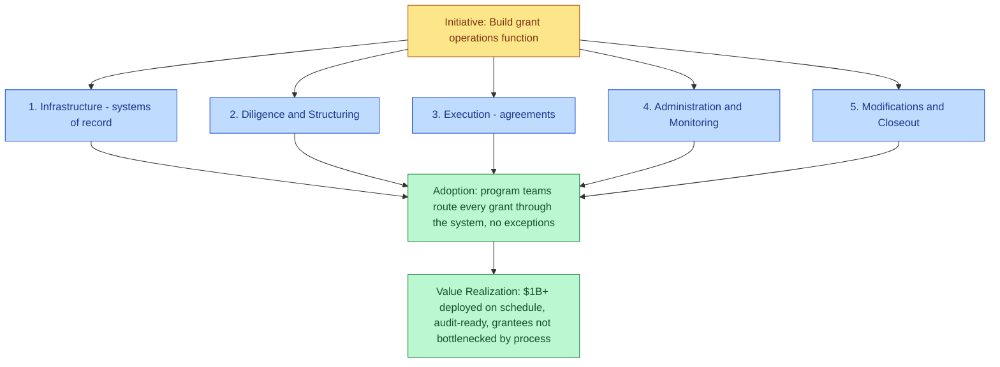

# grant-operations-infrastructure-model

A worked example: designing the operational backbone a foundation needs when it moves from a near-zero grantmaking base to responsibly deploying $1B+ a year — grant register, diligence framework, expenditure responsibility, AI-assisted tracking, and closeout — without treating "the systems are built" and "the systems are working" as the same milestone.

Status: early / worked example. This models one hypothetical mandate end to end rather than defining a general framework. See business-enablement-concept-model (https://github.com/AC-tech-alt/business-enablement-concept-model) for the underlying concept model this is built on.

## The scenario

A foundation is building its grantmaking operation from a near-zero base: no grant register yet, no formal diligence framework, no expenditure-responsibility process, and a mandate to deploy well over $1 billion a year across multiple program areas — quickly, responsibly, and with AI built into how grants get tracked and reviewed. Whoever owns this reports to the CFO and is accountable for everything from initial diligence through final closeout, while the portfolio is already moving.

## Business Problem to Initiative

Business Problem: The foundation has committed to deploying at least $1 billion in year one across several program areas, with no operational infrastructure — policies, systems, controls — built yet to support that volume and complexity responsibly.

Initiative: Build the grant operations function — the systems, processes, policies, and controls that carry a grant from initial diligence through final closeout — reporting directly to the CFO.

## The five Workflows

This mandate isn't one job — it's five distinct Workflows sitting under one Initiative, each with its own execution plan and its own definition of adoption. Treating this as a single "grant ops is up and running" status is exactly the failure mode this model exists to catch.

### 1. Infrastructure - the systems of record

Execution Plan: Stand up the grant register, reporting-obligation tracker, and compliance-milestone system before the first dollar moves. Select or configure the grants management platform, and design where AI actually earns its place - diligence-memo drafting, deadline tracking, anomaly flags on grantee reporting - rather than bolting AI on as a demo feature.

Field Readiness looks like: Program teams can open one system and see a grant's full status - where it is in diligence, what's been signed, what's owed and when - without asking operations for a manual update.

Evidence this isn't theoretical: Architected the centralized grants and data infrastructure behind a $500M+ global portfolio, and served as Product Owner for a digital grants system transformation that built AI tools directly into Salesforce and grant reporting. A comparable infrastructure rebuild at a prior organization measurably increased cross-functional processing speed by 25% and executive decision-making capacity by 30%.

### 2. Diligence and Structuring

Execution Plan: A standard diligence protocol - organizational, financial, legal, compliance, and reputational - sized to the grant, so a small community grant and a large research commitment don't run through the same checklist.

Field Readiness looks like: Program teams know exactly what diligence a given grant size and structure requires before they bring it to operations, instead of discovering the requirement mid-negotiation.

Evidence: Managed expenditure responsibility and anti-bribery/anti-corruption (ABAC) frameworks with 100% compliance across a $500M+ portfolio, and administered complex international compliance protocols spanning both public-charity and private-foundation regulatory regimes.

### 3. Execution - agreements

Execution Plan: Templated grant agreements by structure type (general operating, restricted, fiscal-sponsorship, cross-border), with a defined approval chain through legal before funds move.

Field Readiness looks like: Legal and program teams share a template library instead of redrafting agreement language for every new grant.

Evidence: Directed the end-to-end lifecycle of 15 high-impact federal agreements, guiding financial modeling for $14M in active awards with senior-stakeholder-grade reporting transparency.

### 4. Administration and Monitoring

Execution Plan: Payment schedules, reporting-obligation calendars, and milestone tracking tied to the grant register, so a missed grantee report surfaces as a flag, not a surprise at renewal time.

Field Readiness looks like: A grantee report lands, gets reviewed against defined criteria, and either clears or escalates, with a record of which happened and when.

Evidence: Currently directs operational execution and fiscal governance for a $500M+ global portfolio, leading a cross-functional team of 12 to 15 and shipping six major process enhancements that increased delivery scalability without a proportional increase in headcount.

### 5. Modifications and Closeout

Execution Plan: A defined path for amendments, extensions, and renegotiated deliverables when circumstances change, and a closeout checklist that captures lessons learned instead of just archiving the file.

Field Readiness looks like: A grant closes cleanly, with final reporting collected and reconciled, in a predictable amount of time rather than an open-ended tail.

Evidence: Managed $50M+ in corporate social impact programs across 10+ Fortune 500 clients end to end, including a $5M rapid-response partnership that moved from structuring through closeout on a compressed timeline without cutting corners on compliance.

## Where I'd start (first 90 days)

Stand up the grant register and reporting-obligation tracker first, before diligence templates and before agreement templates, because every other workflow needs somewhere to write its status. Formalize the expenditure-responsibility and ABAC procedures next, sized for both public-charity and private-foundation grantees, since that's the compliance backbone the CFO relationship depends on. Then pilot one grant category - likely the smallest, fastest-moving one - through the full diligence-to-closeout path before generalizing the system to the rest of the portfolio. Adoption gets checked at each step, not assumed at launch.

## Why this approach

Most grant operations builds get scored on whether the system went live, not on whether program teams actually route grants through it six months later. This example follows the same design philosophy as Evani Govender's CommonGood Atlas (https://www.linkedin.com/pulse/grant-payment-why-grantmaking-systems-need-shared-evani-govender-rn5bc/): name the concepts precisely enough that finance, legal, program, and operations are all working from the same definition of "done" - then build the systems on top of that shared language, not the other way around.

## License

MIT - see LICENSE (./LICENSE).

## Pressure test

The scenarios above are the clean case. See examples/pressure-test.md (./examples/pressure-test.md) for a theoretical stress test against a complex international grant, including an honest look at where the model needed to bend.
